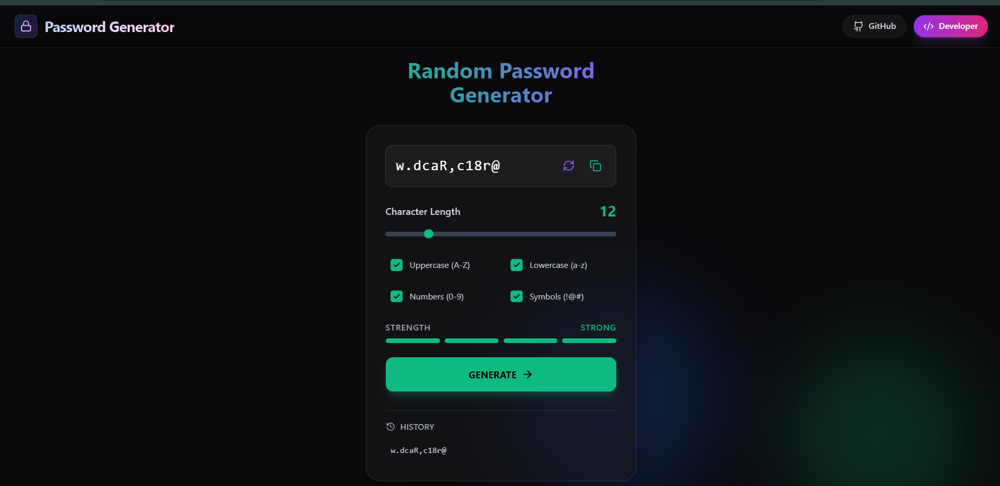

# Random Password Generator

A minor yet powerful web application designed to generate secure, strong, and random passwords instantly. Built with modern web technologies, this tool ensures your online security is just a click away.



## 🚀 Features

-   **Customizable Length**: Generate passwords with lengths ranging from 4 to 50 characters.
-   **Granular Control**: Toggle between Uppercase, Lowercase, Numbers, and Symbols.
-   **Real-time Strength Meter**: Visual feedback on how strong your generated password is.
-   **Password History**: Keeps track of the last 5 generated passwords for quick retrieval.
-   **One-Click Copy**: Easily copy your new password to the clipboard with a visual confirmation.
-   **Responsive Design**: Fully responsive UI that works seamlessly on desktop and mobile.
-   **Glassmorphism UI**: A sleek, modern interface with glassmorphism effects and smooth animations.

## 🛠️ Tech Stack

-   **[React](https://react.dev/)**: For building the user interface.
-   **[Vite](https://vitejs.dev/)**: For fast development and building.
-   **[Tailwind CSS](https://tailwindcss.com/)**: For utility-first styling.
-   **[Framer Motion](https://www.framer.com/motion/)**: For smooth animations.
-   **[Lucide React](https://lucide.dev/)**: For beautiful icons.

## 📦 Installation

1.  **Clone the repository:**
    ```bash
    git clone https://github.com/amitkumarpatra99/RandomPasswordGenerator.git
    cd RandomPasswordGenerator
    ```

2.  **Install dependencies:**
    ```bash
    npm install
    ```

3.  **Start the development server:**
    ```bash
    npm run dev
    ```

4.  **Build for production:**
    ```bash
    npm run build
    ```

## 📝 License

This project is open-source and available under the [MIT License](LICENSE).
